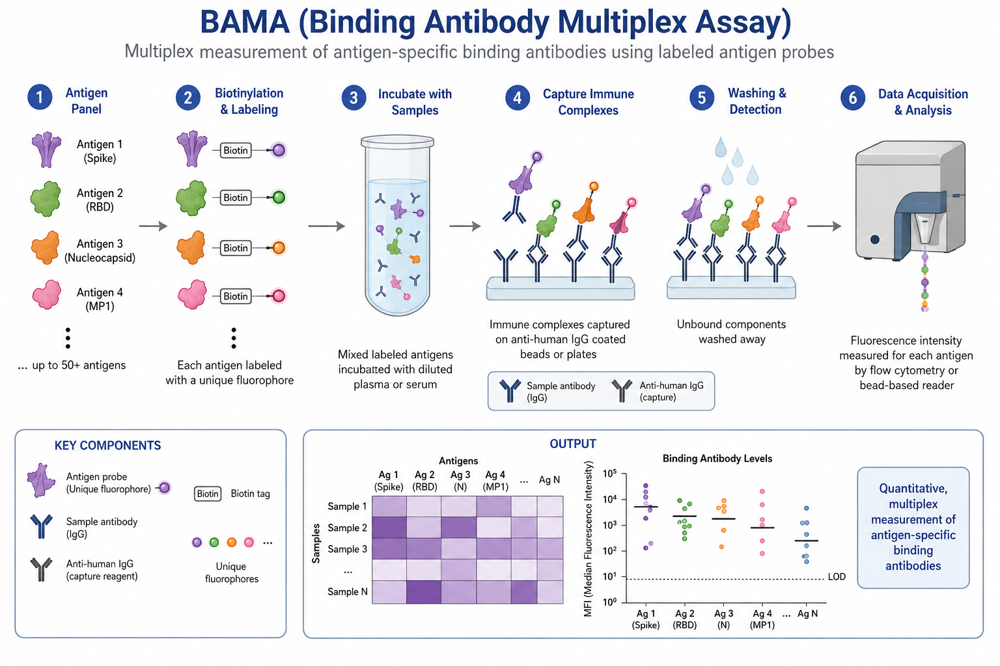
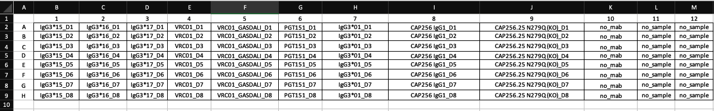

# Binding Antibody Multiplex Assay (BAMA) - Shiny Dashboard
The following repository consists of the first version of the BAMA Assay dashboard.

## Quick information:


** This image was generated by chatgpt (source: https://chatgpt.com/) using biorender (source: https://www.biorender.com/)

## Quick Start

### 1. Install R dependencies

```r
install.packages(c(
  "shiny",
  "shinydashboard",
  "DT",
  "openxlsx",
  "dplyr",
  "stringr",
  "shinyjs",
  "ggplot2",
  "scales",
  "readxl",
  "jsonlite",
  "ggrepel",
  "tidyr",
  "ragg",
  "DescTools",
  "drc"
))
```

### 2. Run the app

```r
shiny::runApp("path/to/neut_dashboard/")
```

Or from RStudio: open `app.R` → click **Run App**.

---

## Dashboard Tabs

| Tab | Description |
|-----|-------------|
| 🏠 Overview | Summary value boxes and workflow guide |
| 🧪 Plate Data Upload | Upload raw xlsx plate files |
| ⚙️ Helper Setup | View/edit the `Scientist ID`, `Run Date` & `Instrument Serial Number` sheets live and download either the pre-filled or empty helper file |
| 📋 Plate Review | Full renamed MFIs matrix per plate |
| 📝 processed | Plate data with every calculation |
| Analysis >>>
| > 🔬 Point-based| QC step to review data after the `📝processed` calculations |
| > 📊 Titration | Interactive titration curves per analyte/sample readout |
| > 🔢 Quantification | Standard curve + Concentration determinant step |
| 💾 Export | Download xlsx workbook matching the original pipeline output |

---

## Input Files

# Intelliflex:

Two files are required: the raw output from the Intelliflex platform + the 96-well Helper file . In addition, select your controls.

# Bioplex:

Only the raw output file, which is fully annotated, is required
